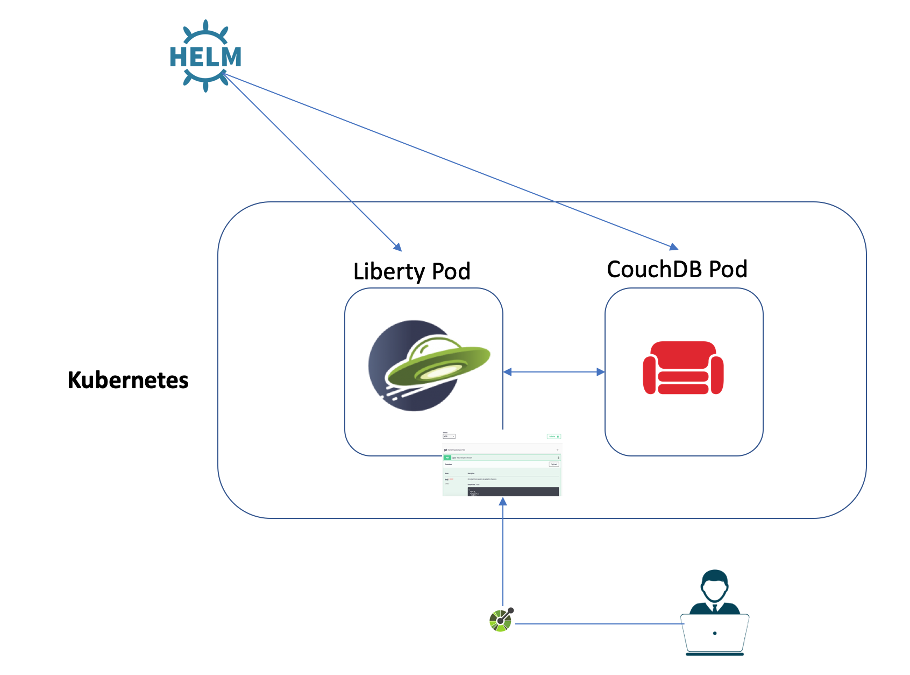
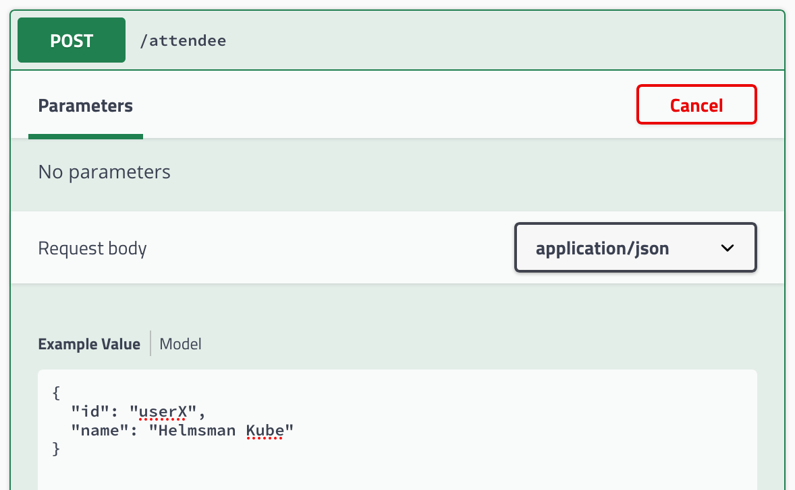
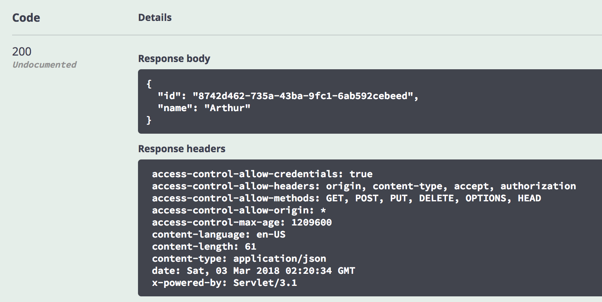

# MicroProfile Lab with Open Liberty and OKD

This lab illustrates steps to deploy a MicroProfile application, running in a Open Liberty Docker container into [OKD](https://www.okd.io) using Open Liberty Operator.

If you find an issue with the lab instruction you can [report it](https://github.com/microservices-api/kubernetes-microprofile-lab/issues) or better yet, [submit a PR](https://github.com/microservices-api/kubernetes-microprofile-lab/pulls).

For questions/comments about Open Liberty Docker container or Open Liberty Operator please email [Arthur De Magalhaes](mailto:arthurdm@ca.ibm.com).

# Before you begin

You'll need a few different artifacts to this lab. It is highly recommended to run the lab on the same VM you installed your OKD cluster on as it should have all the necessary tools already installed. Otherwise, make sure you have have the following packages installed:

```console
$ git --help
$ mvn --help
$ java -help
$ docker --help
$ kubectl --help
$ oc --help
```

If any of these are not installed:

* Install [Git client](https://git-scm.com/download/mac)
* Install [Maven](https://maven.apache.org/download.cgi)
* Install [Docker engine](https://docs.docker.com/engine/installation/)
* Install [Java 8](https://java.com/en/download/)
* Install [kubectl](https://github.com/openshift/origin/releases/download/v3.11.0/openshift-origin-client-tools-v3.11.0-0cbc58b-linux-64bit.tar.gz)
* Install [oc](https://github.com/openshift/origin/releases/download/v3.11.0/openshift-origin-client-tools-v3.11.0-0cbc58b-linux-64bit.tar.gz)

## What is **OKD**?

From [okd.io](https://www.okd.io):
>OKD is a distribution of Kubernetes optimized for continuous application development and multi-tenant deployment. OKD adds developer and operations-centric tools on top of Kubernetes to enable rapid application development, easy deployment and scaling, and long-term lifecycle maintenance for small and large teams. OKD is the upstream Kubernetes distribution embedded in Red Hat OpenShift. OKD embeds Kubernetes and extends it with security and other integrated concepts. OKD is also referred to as Origin in github and in the documentation. An OKD release corresponds to the Kubernetes distribution - for example, OKD 1.10 includes Kubernetes 1.10. If you are looking for enterprise-level support, or information on partner certification, Red Hat also offers Red Hat OpenShift Container Platform.

## What are **Operators**?

From [Red Hat](https://www.redhat.com/en/blog/introducing-operator-framework-building-apps-kubernetes):
> An Operator is a method of packaging, deploying and managing a Kubernetes application. A Kubernetes application is an application that is both deployed on Kubernetes and managed using the Kubernetes APIs and kubectl tooling. To be able to make the most of Kubernetes, you need a set of cohesive APIs to extend in order to service and manage your applications that run on Kubernetes. You can think of Operators as the runtime that manages this type of application on Kubernetes.

## What are **Helm charts**?

Helm is a package manager for Kubernetes (analogous to `yum` and `apt`). You can use it for managing Kubernetes charts (analogous to `debs` and `rpms`), which are packages of pre-configured Kubernetes resources. Instead of running a bunch of commands or maintaining multiple configuration files to create Kubernetes resources, Helm packages all the resources required to successfully run a service or multiple dependent services in one chart.

# Deploying a MicroProfile application in an OKD cluster

This lab will walk you through the deployment of our sample MicroProfile application into an OKD cluster. You'll build a MicroProfile application and package it inside a Open Liberty Docker container. You will then utilize an operator that deploys an Open Liberty container to OKD, with the appropriate service setup, while also deploying and configuring a CouchDB Helm chart that stands up the a database that holds data for this microservice.

## Setting up the cluster

To setup a VM in vLaunch and install OKD, see [instructions here](https://apps.na.collabserv.com/wikis/home?lang=en-us#!/wiki/Wfe97e7c353a2_4510_8471_7148220c0bec/page/Setting%20up%20a%20vLaunch%20System%20for%20Red%20Hat%20OpenShift%20Lab).

## Part 1A: Build the application and Docker container

### Vote Microservice

The vote microservice stores feedback from the sessions and displays how well all sessions were liked in a pie chart.  If the vote service is configured (via `server.xml`) to connect to a CouchDB database, the votes will be persisted. Otherwise, the vote data will simply be stored in-memory. This sample application is one of the MicroProfile [showcase](https://github.com/eclipse/microprofile-conference/tree/master/microservice-vote) applications.

You can clone the lab artifacts and explore the application:

1. Navigate to your home directory:
    ```console
    $ cd ~
    ```
1. Clone the project into your machine:
    ```console
    $ git clone https://github.com/microservices-api/kubernetes-microprofile-lab.git
    ```
1. Navigate into the sample application directory:
    ```console
    $ cd kubernetes-microprofile-lab/lab-artifacts/application
    ```
1. See if you can find where technologies described below are used in the application.

### Usage of technologies

* **JAX-RS** is used to to define the endpoints for the application, and performs JSON data binding on incoming and outgoing JSON data so that the rest of the code can utilize the data as POJOs.

* **CDI** is used to instantiate data access objects (DAO's) and manage invocation of life cycle operations such as `@PostConstricut`.

* **JSON-P** is used to implement custom JAX-RS MessageBodyReader/Writer classes for binding between JSON and POJO.

* **MicroProfile Config** is used to inject CouchDB's URL, username and password to the application.

* **MicroProfile Fault-Tolerance** is used in the CouchAttendeeDAO and CouchSessionRatingDAO to:

  * impose timeouts on various operations using `@Timeout`.
  * automatically retry failed operations using `@Retry`.
  * limit the maximum resources allocated to parallel operations using `@Bulkhead`.

* **MicroProfile Health** is used to provide an UP/DOWN health check of the service.  The following health checks are implemented:

  * HashMapDAO to determine if the in-memory storage is accessible (which is always) and gives an example of an UP status.
  * CouchAttendeeDAO to determine if it can connect to the database backend.
  * CouchSessionDAO to determine if it can connect to the database backend.

* **MicroProfile Metrics** is used to gather metrics about the time it takes the HashMapDAO objects to complete their operations, and to keep a count of the amount of times each REST endpoint is requested.

### Dockerizing Vote Microservice

By now you should have a general understanding about the application. Now, you will see how you can package the sample application into a Docker container by using a Dockerfile that contains instructions on how the image is built.

In this lab we demonstrate a best-practice pattern which separates the concerns between the enterprise architect and the developer.  We first build a Docker image that will act as our `enterprise base image`, which in a company would be the shared curated image that all developers must start from - this allows for consistent and compliance across the enterprise.  We then build the developer's Docker image, which starts from the enterprise base image and adds only the application and related configuration.

The following steps will build the sample application and create a Docker image that includes the vote microservice:

1. Navigate into the sample application directory if you are not already:
    ```console
    $ cd kubernetes-microprofile-lab/lab-artifacts/application
    ```
1. Build the sample application:
    ```console
    $ mvn clean package
    ```
1. Navigate into the `lab-artifacts` directory
    ```console
    $ cd ..
    ```
1. Build and tag the Enterprise Docker image:
    ```console
    $ docker build -t microservice-enterprise-web:1.0.0  -f EnterpriseDockerfile .
    ```
1. Build and tag the Application Docker image:
    ```console
    $ docker build -t microservice-vote:1.0.0  -f ApplicationDockerfile .
    ```
1. You can use the Docker CLI to verify that your image is built.
    ```console
    $ docker images
    ```
    If things have gone well, the output should look like this:
    ```console
    REPOSITORY                                                     TAG       IMAGE ID        CREATED         SIZE
    microservice-vote                                              1.0.0     8fe8ff1be07d    24 hours ago    369 MB
    microservice-enterprise-web                                    1.0.0     61d03c45ca21    25 hours ago    350 MB
    ```

## Part 1B: Upload the Docker image to OKD's internal registry

OKD provides an internal, integrated container image registry that is installed in your cluster. For this lab, we will use this registry to host our application image.

If you are using the same VM as the OKD VM, your images will be available in OKD's container registry for consumption after you run the following steps. But if you are not running on the same VM, skip the following 6 commands and continue from there:

1. Ensure you are logged in to OKD. Replace `<username>`, `<password>` and `<okd_ip>` with appropriate values:
    ```console
    $ oc login --username=<username> --password=<password> https://console.<okd_ip>.nip.io:8443/
    ```
1. Create a project to in OKD:
    ```bash
    $ oc new-project myproject
    ```
1. Tag your docker image to make it available to be used in `myproject`:
    ```bash
    $ docker tag microservice-vote:1.0.0 docker-registry.default.svc:5000/myproject/microservice-vote:1.0.0
    ```
1. You can use the Docker CLI to verify that your image is built.
    ```console
    $ docker images
    ```
    The output should now look like this:
    ```console
    REPOSITORY                                                     TAG       IMAGE ID        CREATED         SIZE
    docker-registry.default.svc:5000/myproject/microservice-vote   1.0.0     8fe8ff1be07d    24 hours ago    369 MB
    microservice-vote                                              1.0.0     8fe8ff1be07d    24 hours ago    369 MB
    microservice-enterprise-web                                    1.0.0     61d03c45ca21    25 hours ago    350 MB
    ```
1. You can also see your image the OKD's Registry Dashboard available at `https://registry-console-default.apps.<okd_ip>.nip.io/registry`. You can use the same username and password as the one used in `oc login` command.
1. You skip the next few commands and go to Part 2.

Run the following steps **only** if you are running the lab on a system other than the OKD VM:

1. Ensure you are logged in to OKD. Replace `<username>`, `<password>` and `<okd_ip>` with appropriate values:
    ```console
    $ oc login --username=<username> --password=<password> https://console.<okd_ip>.nip.io:8443/
    ```
1. Create a new project to host our application:
    ```console
    $ oc new-project myproject
    ```
1. Log into the internal registry:
    ```console
    $ docker login -u $(oc whoami) -p $(oc whoami -t) docker-registry-default.apps.<okd_ip>.nip.io
    ```
1. Tag your Docker image:
    ```console
    $ docker tag microservice-vote:1.0.0 docker-registry-default.apps.<okd_ip>.nip.io/myproject/microservice-vote:1.0.0
    ```
1. Now your tagged image into the registry:
    ```console
    $ docker push docker-registry-default.apps.<okd_ip>.nip.io/myproject/microservice-vote:1.0.0
    ```
1. To verify your image is available in the registry, check the OKD's Registry Dashboard available at `https://registry-console-default.apps.<okd_ip>.nip.io/registry`. Use the same username and password as the one used in `oc login` command.

## Part 2: Deploy Open Liberty operator and and CouchDB Helm chart

In this part of the lab you will install an operator and a Helm chart.

### Deploy CouchDB Helm

In this section, we will deploy CouchDB Helm chart. However, as OKD does not come with tiller, we will install tiller on the cluster and set up Helm CLI to be able to communicate with the tiller.

1. Create a project for Tiller
    ```console
    $ oc new-project tiller
    ```
1. Download Helm CLI and install the Helm client locally:

    Linux:
    ```console
    $ curl -s https://storage.googleapis.com/kubernetes-helm/helm-v2.9.0-linux-amd64.tar.gz | tar xz
    $ cd linux-amd64
    ```

    OSX:
    ```console
    $ curl -s https://storage.googleapis.com/kubernetes-helm/helm-v2.9.0-darwin-amd64.tar.gz | tar xz
    $ cd darwin-amd64
    ```

1. Now configure the Helm client locally. **Note:** _This will replace your current's Helm CLI. If you can create a back up of your current Helm CLI and replace the lab's Helm CLI after you are done with the lab_:
    ```console
    $ sudo mv helm /usr/local/bin
    $ sudo chmod a+x /usr/local/bin/helm
    $ helm init --client-only
    ```
1. Install the Tiller server:
    ```console
    $ oc process -f https://github.com/openshift/origin/raw/master/examples/helm/tiller-template.yaml -p TILLER_NAMESPACE="tiller" -p HELM_VERSION=v2.9.0 | oc create -f -
    $ oc rollout status deployment tiller
    ```
    Rollout process might take a few minutes to complete. You can check the status of the deployment using `oc get deployment`.
1. If things go well, the following commands should run successfully and you will see version of both the client and the server:
    ```console
    $ helm version --tiller-namespace=tiller
    ```
    Since we did not install Tiller in its default namespace (`kube-system`), we had to specify `--tiller-namespace=tiller`. Alternatively, you can run `export TILLER_NAMESPACE=tiller` instead of specifying `--tiller-namespace=tiller` in your Helm commands.

Now that Helm is configured both locally and on OKD, you can deploy CouchDB Helm chart.
1. Navigate to `kubernetes-microprofile-lab/lab-artifacts/helm/database`:
    ```console
    $ cd /lab-artifacts/helm/database
    ```
1. Switch project to `myproject`:
    ```console
    $ oc project myproject
    ```
1. Grant the Tiller server `edit` and `admin` access to the current project:
    ```console
    $ oc policy add-role-to-user edit "system:serviceaccount:tiller:tiller"
    $ oc policy add-role-to-user admin "system:serviceaccount:tiller:tiller"
    ```
1. Allow the default service account for the `myproject` namespace to run containers as any UID:
    ```console
    $ oc adm policy add-scc-to-user anyuid system:serviceaccount:myproject:default
    ```
1. Deploy the CouchDB Helm chart:
    ```console
    $ helm install couchdb-1.2.0.tgz -f db_values.yaml --name couchdb --tiller-namespace=tiller
    ```
    Ensure the CouchDB pod is up and running by executing `oc get pods` command. It might take a few minutes and the CouchDB pod might restart a few times but eventually the output of should look similar to the following:
     ```console
    NAME                            READY   STATUS    RESTARTS   AGE
    couchdb-couchdb-0               2/2     Running   0          3m
    ```

    You need to wait until the value under `READY` column becomes `2/2`. Re-run the `oc get pods` command if necessary.

### Deploy Open Liberty Operators

Before we deploy an Open Liberty Operator, watch these two videos to get familiar with Operators
* [Red Hat OpenShift: Operators Framework](https://youtu.be/LymzLHRbQdk)
* [Keynote: Maturing Kubernetes Operators](https://youtu.be/kld1Fi8RrRQ)

If you need more information about Operators, here is a good source to start: [Operators on Red Hat OpenShift](https://www.openshift.com/learn/topics/operators).

#### Install Open Liberty artifacts

1. Navigate to Open Liberty Operator artifact directory:
    ```console
    $ cd ../../operator/open-liberty-operator
    ```
1. Install Open Liberty Operator Lifecycle Manager (OLM):
    ```console
    $ oc apply -f olm/open-liberty-crd.yaml
    ```
1. Open Liberty Operator requires the following Kubernetes resources to be installed: ServiceAccount, Role and RoleBinding resources. Run the following commands to deploy them:
    ```console
    $ oc apply -f deploy/service_account.yaml
    $ oc apply -f deploy/role.yaml
    $ oc apply -f deploy/role_binding.yaml
    ```
1. Now create an instance of the Open Liberty operator:
    ```console
    $ oc apply -f deploy/operator.yaml
    ```

    You would need to wait for the Open Liberty Operator installation to be completed. You can check the status using `oc get pods` and wait until the `open-liberty-operator` pod is ready.

#### Deploy application

1. Deploy the microservice application using the provided CR:
    ```console
    $ cd ../application
    $ oc apply -f application-cr.yaml
    ```
1. You can view the status of your deployment by running `oc get deployments`.  If the deployment is not coming up after a few minutes one way to debug what happened is to query the pods with `oc get pods` and then fetch the logs of the Liberty pod with `oc logs <pod>`.
1. We will access the application using NodePort service. Run the following command to get the service port:
    ```console
    $ oc get service operator-lab-openliberty -o=jsonpath='{.spec.ports[0].nodePort}'
    ```
    Now, from your browser, go to `https://console.<okd_ip>.nip.io:<service_port>/openapi/ui/`. If those invocations are still taking long, please wait a few minutes for the deployment to fully initiate.
1. Congratulations! You have successfully deployed a [MicroProfile](http://microprofile.io/) container into an OKD cluster using operators!

## Part 3: Explore the application

The `vote` application is using various MicroProfile specifications.  The `/openapi` endpoint of the application exposes the [MicroProfile OpenAPI](http://download.eclipse.org/microprofile/microprofile-open-api-1.0.1/microprofile-openapi-spec.html) specification.  The `/openapi/ui` endpoint is a value-add from Liberty.  This UI allows developers and API consumers to invoke the API right from the browser!

1. Expand the `POST /attendee` endpoint and click the `Try it out` button.
1. Place your username (e.g. userX) in the `id` field, and place your name in the `name` field.
    
1. Click on the `Execute` button.  Scroll down and you'll see the `curl` command that was used, the `Requested URL` and then details of the response.  This entry has now been saved into the CouchDB database that our microservice is using.
    
1. Now expand the `GET /attendee/{id}`, click the `Try it out` button, and type into the textbox the `id` you entered from the previous step.
1. Click on `Execute` and inspect that the `Respond body` contains the same name that you created in step 2. You successfully triggered a fetch from our microservice into the CouchDB database.
1. Feel free to explore the other APIs and play around with the microservice!

## Part 4: Update the Liberty Operator release

In this part of the lab you will practice how to make changes to the Liberty deployment you just deployed on the cluster using the Open Liberty Operator.

The update scenario is that you will increase the number of replicas for the Liberty deployment to 3. That will increase the number of Open Liberty pods to 3.

1. In `lab-artifacts/operator/application/application-cr.yaml` file, change `replicaCount` value to 3.
1. Navigate to `lab-artifacts/operator/application` directory:
    ```console
    $ cd lab-artifacts/operator/application
    ```
1. Apply the changes into the cluster:
    ```console
    $ oc apply -f application-cr.yaml
    ```
1. You can view the status of your deployment by running `oc get deployments`. It might take a few minutes until all the pods are ready.

In this part you were introduced to rolling updates. DevOps teams can perform zero-downtime application upgrades, which is an important consideration for production environments.

Congratulations! You finished the lab! You got to use a few powerful tools to deploy a microservice into OKD. Although this lab is finished but the journey to Kubernetes should not end here!
