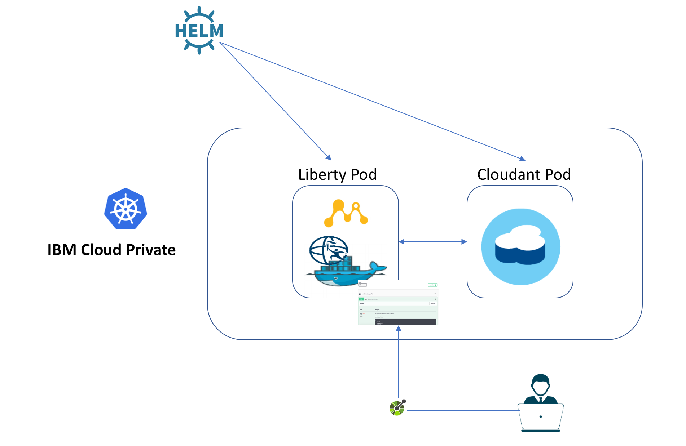

# MicroProfile Lab with IBM Cloud Private and WebSphere Liberty

This lab illustrates steps to deploy a MicroProfile application, running in a WebSphere Liberty docker container, into a Kubernetes environment, such as [IBM Cloud Private](https://github.com/microservices-api/kubernetes-microprofile-lab#part-2-deploying-a-microprofile-application-in-an-ibm-cloud-private-cluster-icp), and [minikube (bonus)](https://github.com/microservices-api/kubernetes-microprofile-lab/tree/master/minikube).

If you find an issue with the lab instruction you can [report it](https://github.com/microservices-api/kubernetes-microprofile-lab/issues) or better yet, [submit a PR](https://github.com/microservices-api/kubernetes-microprofile-lab/pulls).

For questions/comments about WebSphere Liberty's docker container or IBM Cloud Private please email [Arthur De Magalhaes](mailto:arthurdm@ca.ibm.com).

# Before you begin

You'll need a few different artifacts to this lab.  Check if you have these installed by running:

```
git --version
mvn --version
java -version
docker --version
helm version
minikube version (bonus)
```

If any of these is not installed:
* Install a [Git client](https://git-scm.com/download/mac).
* Install [Maven](https://maven.apache.org/download.cgi).
* Install a [Docker engine](https://docs.docker.com/engine/installation/).
* Install [Java 8](https://java.com/en/download/)
* Install [helm](https://docs.helm.sh/using_helm/#installing-helm)
* Install [minikube](https://kubernetes.io/docs/tasks/tools/install-minikube/) (bonus)

This lab has been tested on Mac OSX (High Sierra), Ubuntu 16.04 and Windows 10, but it should work with any OS that supports the above software.

# Deploying a MicroProfile application in an IBM Cloud Private cluster (ICP)

This part of the lab will walk you through the deployment of our sample MicroProfile Application into an IBM Cloud Private cluster, which is built on the open source Kubernetes framework. you'll build a MicroProfile application and package it inside a WebSphere Liberty docker container. You will then utilize a helm chart that deploys the Liberty container in ICP, with the appropriate ingress and service setup, while also deploying and configuring a Cloudant helm chart that stands up the database that holds the data for this microservice.

## Setup a working environment with IBM Cloud Private (ICP)

1. You will be provided with a working ICP.
1. The `helm` CLI in ICP is protected by TLS, so you need to follow [these instructions](https://www.ibm.com/support/knowledgecenter/en/SSBS6K_2.1.0.3/app_center/create_helm_cli.html) to setup a protected connected between your machine (client) and the ICP cluster you want to reach.
1. Once the TLS certificates are in place, you can always go into `Configure client` to copy the commands necessary to configure your local CLI to target the ICP cluster:

1. We will be using the private docker image registry from ICP, so you'll need to [setup the connection](https://www.ibm.com/support/knowledgecenter/en/SSBS6K_2.1.0.3/manage_images/configuring_docker_cli.html) so that you can login into that registry later in the lab.

# Part 1A: Build the application and docker container

1. Clone the project into your machine by running `git clone https://github.com/microservices-api/kubernetes-microprofile-lab.git`
1. Build the sample microservice by running `cd kubernetes-microprofile-lab/lab-artifacts` and then  `mvn clean package`
1. Build and tag the docker image by using `docker build` and providing a tag that matches your `<cluster_CA_domain>/<namespace>/microservice-vote`.   As an example, if your `<cluster_CA_domain>` is `mycluster.icp` and you used the `default` namespace, then your command would be `docker build -t mycluster.icp:8500/default/microservice-vote`.

# Part 1B: Upload the docker image to IBM Cloud Private's docker registry

We will use IBM Cloud Private's internal docker registry to host our docker image.  This allows our image to remain secured on-premises, while being available to your enterprise.  You can control which kubernetes namespace they are available under.

1. Follow the instruction on [this page](https://www.ibm.com/support/knowledgecenter/en/SSBS6K_2.1.0.3/manage_images/using_docker_cli.html) to `docker login` into the ICP docker registry.  Use the credentials you setup during installation (default is `admin/admin`).
1. Now that you're logged in the registry, you can `docker push` your tagged image (`microservice-vote`) into the ICP docker registry.  Example:  `docker push mycluster.icp:8500/default/microservice-vote`
1. Your image is now available in the ICP registry, which you can verify by going into `Catalog -> Images`.   


# Part 2: Deploy WebSphere Liberty and Cloudant helm chart

1. Deploy the microservice with the following helm install command `helm install --name=vote helm-chart/microservice-vote --set image.repository=mycluster.icp:8500/default/microservice-vote`.
1. You can view the status of your deployment by running `kubectl get deployments`.  You want to wait until both `microservice-vote-deployment` and `vote-ibm-cloudant-dev` deployments are available.
1. Let's check on our deployment.  Go into `Workloads -> Deployments` and click on the release name you picked.  Click on the `Endpoint` link, which brings up the ingress URL.   Add `/openapi/ui` to the URL to reach the OpenAPI User Interface.   For example, `https://192.168.99.100/openapi/ui`.
1. Congratulations, you have successfully deployed a [MicroProfile](http://microprofile.io/) container into a kubernetes cluster!  The deployment also included a Cloudant container that is used by our microservice, and an ingress layer to provide connectivity into the API.

# Part 3: Explore the application

The `vote` application is using various MicroProfile specifications.  The `/openapi` endpoint of the application exposes the [MicroProfile OpenAPI](http://download.eclipse.org/microprofile/microprofile-open-api-1.0.1/microprofile-openapi-spec.html) specification.  The `/openapi/ui` endpoint is a value-add from [Open Liberty](https://openliberty.io/), which WebSphere Liberty is based upon.  This UI allows developers and API consumers to invoke the API right from the browser!

1. Expand the `POST /attendee` endpoint and click the `Try it out` button.
1. Leave the `id` empty, and place your name in the `name` field.

1. Click on the `execute` button.  Scroll down and you'll see the `curl` command that was used, the `Requested URL` and then details of the response.  Copy the `id` from the `Response body`.  This entry has now been saved into the Cloudant database that our microservice is using.
 
1. Now expand the `GET /attendee/{id}`, click the `Try it out` button, and paste into the textbox the `id` you copied from the previous step.
1. Click on `execute` and inspect that the `Respond body` contains the same name that you created 2 steps ago. You successfully triggered a fetch from our WebSphere Liberty microservice into the Cloudant database.
1. Feel free to explore the other APIs and play around with the microservice!

## Stay in sync

1.  Join the ICP [technical community](https://www.ibm.com/developerworks/community/wikis/home?lang=en#!/wiki/W1559b1be149d_43b0_881e_9783f38faaff) to stay up to date with news related to IBM Cloud Private.

# [Bonus: Deploying a MicroProfile application in a minikube cluster](minikube/README.md)

 In the bonus section you'll build a MicroProfile application and package it inside a WebSphere Liberty docker container. You will then utilize a helm chart that deploys the Liberty container into a kubernetes cluster (minikube), with the appropriate ingress and service setup, while also deploying and configuring a Cloudant helm chart that stands up the database that holds the data for this microservice.  

 We will walk you through the deployment of our sample MicroProfile Application into a minikube. You'll notice that we're using the exact same artifacts (helm charts & docker containers) as the steps for ICP. However, minikube is the simplest way for a developer to get a kubernetes cluster up and running locally in their laptop.
