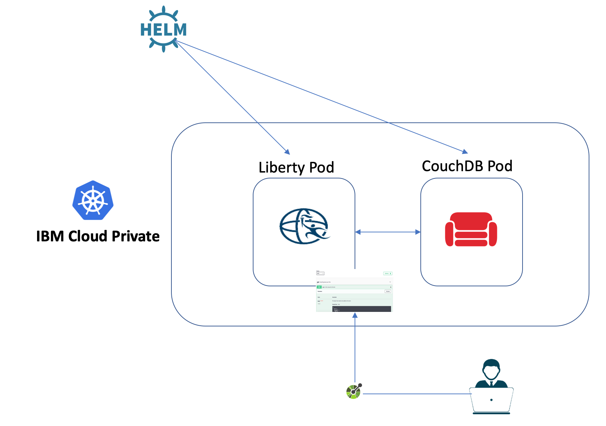
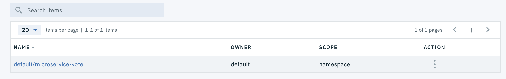

# MicroProfile Lab with IBM Cloud Private and WebSphere Liberty

This lab illustrates steps to deploy a MicroProfile application, running in a WebSphere Liberty Docker container, into a Kubernetes environment, such as [IBM Cloud Private](https://github.com/microservices-api/kubernetes-microprofile-lab#part-2-deploying-a-microprofile-application-in-an-ibm-cloud-private-cluster-icp), and [minikube (bonus)](https://github.com/microservices-api/kubernetes-microprofile-lab/tree/master/minikube).

If you find an issue with the lab instruction you can [report it](https://github.com/microservices-api/kubernetes-microprofile-lab/issues) or better yet, [submit a PR](https://github.com/microservices-api/kubernetes-microprofile-lab/pulls).

For questions/comments about Liberty's Docker container or IBM Cloud Private please email [Arthur De Magalhaes](mailto:arthurdm@ca.ibm.com).

# Before you begin

You'll need a few different artifacts to this lab.  Check if you have these installed by running:

```
git --help
mvn --help
java -help
docker --help
kubectl --help
helm --help
cloudctl --help
```

If any of these is not installed:

* Install [Git client](https://git-scm.com/download/mac)
* Install [Maven](https://maven.apache.org/download.cgi)
* Install [Docker engine](https://docs.docker.com/engine/installation/)
* Install [Java 8](https://java.com/en/download/)
* Install [kubectl](https://www.ibm.com/support/knowledgecenter/SSBS6K_3.1.0/manage_cluster/cfc_cli.html)
* Install [helm](https://www.ibm.com/support/knowledgecenter/SSBS6K_3.1.0/app_center/create_helm_cli.html)
* Install [cloudctl](https://www.ibm.com/support/knowledgecenter/SSBS6K_3.1.0/manage_cluster/install_cli.html)

This lab has been tested on Mac OSX (High Sierra), Ubuntu 16.04 and Windows 10, but it should work with any OS that supports the above software.

# Deploying a MicroProfile application in an IBM Cloud Private cluster (ICP)

This part of the lab will walk you through the deployment of our sample MicroProfile Application into an IBM Cloud Private cluster, which is built on the open source Kubernetes framework. You'll build a MicroProfile application and package it inside a WebSphere Liberty Docker container. You will then utilize a Helm chart that deploys the Liberty container in ICP, with the appropriate service setup, while also deploying and configuring a CouchDB Helm chart that stands up the database that holds the data for this microservice.

## Prerequisites

1. The user's namespace pod security policy must be no more restrictive than `ibm-anyuid-psp` or CouchDB will not run. We have instructions to configure the namespace you'll create later in the lab.
    1. https://github.com/IBM/cloud-pak/tree/master/spec/security/psp

1. A ClusterImagePolicy must exist that allows the following registry URLs. This is already done on the cluster you're provided for the workshop.
    1. `docker.io/kocolosk/couchdb-statefulset-assembler:*`
    1. `docker.io/couchdb*`

## Accessing your cluster from CLI

In this lab you will use a few command line interfaces (CLIs):

* `docker`: A tool that acts as a client to interact with Docker daemon.
* `kubectl`: A powerful tool for running commands against any Kubernetes clusters including ICP.
* `cloudctl`: A command line tool to interact with IBM Cloud Private.
* `helm`: Is a tool for managing Kubernetes charts which are packages of pre-configured Kubernetes resources.

To access your cluster using these tools, you need to log in to your cluster. Once you are logged in, a protected connection between your machine (client) and the ICP cluster you want to reach will be set up.

1. Log in to the VM that you set up previously. 
1. Log in to your cluster:
    ```bash
    cloudctl login -a https://mycluster.icp:8443 -c id-mycluster-account --skip-ssl-validation
    ```
    Your machine is setup to resolve `mycluster.icp` into the ip address of the master node of a shared ICP cluster.
1. Enter the credentials. Username is `admin` and password is `admin`
1. Select the `default` namespace when prompted by entering the number next to the namespace.
1. Once you are successfully logged in, you should see the following message:
    ```bash
    Configuring kubectl ...
    Property "clusters.mycluster" unset.
    Property "users.mycluster-user" unset.
    Property "contexts.mycluster-context" unset.
    Cluster "mycluster" set.
    User "mycluster-user" set.
    Context "mycluster-context" created.
    Switched to context "mycluster-context".
    OK

    Configuring helm: /home/student/.helm
    OK
    ```
1. Create a unique namespace (For example: use your github username):
    ```bash
    kubectl create namespace <NAMESPACE>
    ```
1. Configure your namespace:
    ```bash
    kubectl -n <NAMESPACE> create rolebinding <NAMESPACE>-psp --clusterrole=ibm-anyuid-clusterrole --group=system:serviceaccounts:<NAMESPACE>
    ```
1. Switch to the namespace that you created:
    ```bash
    cloudctl target -n <NAMESPACE>
    ```
1. You can now explore `kubectl` and `cloudctl` CLIs.
1. Run the following commands to get familiar with these tools:
    1. `kubectl version`: Print the client and server version information.
    1. `kubectl cluster-info`: Display cluster info.
    1. `kubectl config view`: Display merged kubeconfig settings.
    1. `kubectl help`: Get help!
    1. `cloudctl version`: Check CLI and API version information.
    1. `cloudctl cm nodes`: List of all nodes in the cluster.
    1. `cloudctl cm masters`: List of all master nodes.
    1. `cloudctl cm master-get <MASTER_NODE_ID>`: View the details about a master node.
    1. `cloudctl catalog charts`: List of Helm charts in the cluster helm repositories. Soon, you'll learn about Helm charts!
    1. `cloudctl help`: Get help!
1. Congratulations!

## Accessing your IBM Cloud Private cluster by using the management console

You can access your IBM Cloud Private cluster management console from a web browser.

1. Find out the master ip which we will use in the later steps:
    ```bash
    cloudctl cm masters
    ```
    You should get an output similar to the following:
    ```bash
    ID             Private IP     Machine Type   State      K8s Status
    mycluster-m1   <MASTER_IP>    -              deployed   Ready
    ```
1. From a web browser, browse to the URL for your cluster. The URL is `https://<MASTER_IP>:8443`.
1. Enter the credentials: admin/admin
1. From the top horizontal menu bar, click Catalog.
1. The Catalog provides a centralized location from which you can browse for and install Helm charts in your cluster. A chart consists of templates for a set of resources necessary to run an application and includes a values file that configures the resources.
1. From the top left main Menu, click on **Workloads** and then **Helm Releases**.
1. You can see the list of all Helm releases deployed into the cluster. Many of the deployments are internal resources required by ICP itself.

# Part 1A: Build the application and Docker container

## Vote Microservice

The vote microservice stores feedback from the sessions and displays how well all sessions were liked in a pie chart.  If the vote service is configured (via server.xml) to connect to a CouchDB database, the votes will be persisted. Otherwise, the vote data will simply be stored in-memory. This sample application is one of the MicroProfile [showcase](https://github.com/eclipse/microprofile-conference/tree/master/microservice-vote) applications.

You can clone the lab artifacts and explore the application:

1. Clone the project into your machine:
    ```bash
    git clone https://github.com/microservices-api/kubernetes-microprofile-lab.git
    ```
1. Navigate into the sample application directory:
    ```bash
    cd kubernetes-microprofile-lab/lab-artifacts/application
    ```
1. See if you can find where technologies described below are used in the application.

### Usage of technologies

* **JAX-RS** is used to to define the endpoints for the application, and performs JSON data binding on incoming and outgoing JSON data so that the rest of the code can utilize the data as POJOs.

* **CDI** is used to instantiate data access objects (DAO's) and manage invocation of life cycle operations such as `@PostConstricut`.

* **JSON-P** is used to implement custom JAX-RS MessageBodyReader/Writer classes for binding between JSON and POJO.

* **MicroProfile Config** is used to inject CouchDB's URL, username and password to the application.

* **MicroProfile Fault-Tolerance** is used in the CouchAttendeeDAO and CouchSessionRatingDAO to:

  * impose timeouts on various operations using `@Timeout`.
  * automatically retry failed operations using `@Retry`.
  * limit the maximum resources allocated to parallel operations using `@Bulkhead`.

* **MicroProfile Health** is used to provide an UP/DOWN health check of the service.  The following health checks are implemented:

  * HashMapDAO to determine if the in-memory storage is accessible (which is always) and gives an example of an UP status.
  * CouchAttendeeDAO to determine if it can connect to the database backend.
  * CouchSessionDAO to determine if it can connect to the database backend.

* **MicroProfile Metrics** is used to gather metrics about the time it takes the HashMapDAO objects to complete their operations, and to keep a count of the amount of times each REST endpoint is requested.

## Dockerizing Vote Microservice

By now you should have a general understanding about the application. Now you will see how you can package the sample application into a Docker container by using a Dockerfile that contains instructions on how the image is built.

In this lab we demonstrate a best-practice pattern which separates the concerns between the enterprise architect and the developer.  We first build a Docker image that will act as our `enterprise base image`, which in a company would be the shared curated image that all developers must start from - this allows for consistent and compliance across the enterprise.  We then build the developer's Docker image, which starts from the enterprise base image and adds only the application and related configuration.

The following steps will build the sample application and create a Docker image that includes the vote microservice:

1. Navigate into the sample application directory if you are not already:
    ```bash
    cd kubernetes-microprofile-lab/lab-artifacts/application
    ```
1. Build the sample application:
    ```bash
    mvn clean package
    ```
1. Build and tag the Enterprise Docker image:
    ```bash
    cd ..
    docker build -t microservice-enterprise-web:1.0.0  -f EnterpriseDockerfile .
    ```
1. Build and tag the Application Docker image:
    ```bash
    docker build -t mycluster.icp:8500/<NAMESPACE>/microservice-vote:1.0.0  -f ApplicationDockerfile .
    ```
    In above command (as well as in all subsequent commands), replace `<NAMESPACE>` with the unique namespace you created earlier. As an example:
    ```bash
    docker build -t mycluster.icp:8500/userX/microservice-vote:1.0.0 -f ApplicationDockerfile .
    ```
1. You can use the Docker CLI to verify that your image is built:
    ```bash
    docker images
    ```

# Part 1B: Upload the Docker image to IBM Cloud Private's Docker registry

We will use IBM Cloud Private's internal Docker registry to host our image.  This allows our image to remain secured on-premises, while being available to your enterprise.  You can control which Kubernetes namespace they are available under.

1. Log in to your private image registry using the provided credential (admin/admin):
    ```bash
    docker login mycluster.icp:8500
    ```
1. Now that you're logged in the registry, you can `docker push` your tagged image (`microservice-vote`) into the ICP Docker registry:
    ```bash
    docker push mycluster.icp:8500/<NAMESPACE>/microservice-vote:1.0.0
    ```
1. Your image is now available in the Docker registry in ICP. You can verify this through the management console: `Console -> Container Images`. Search for `microservice-vote`

    

# Part 2: Deploy Liberty and CouchDB Helm charts

You can use ICP Dashboard to deploy Helm charts into your Kubernetes cluster through the Catalog page. In addition, you can use Helm command line tool to install a Helm chart which we will do in this part of the lab.

First, let's see what are **Helm charts**. Helm is a package manager for Kubernetes (analogous to `yum` and `apt`). You can use it for managing Kubernetes charts (analogous to `debs` and `rpms`), which are packages of pre-configured Kubernetes resources. Instead of running a bunch of commands or maintaining multiple configuration files to create Kubernetes resources, Helm packages all the resources required to successfully run a service or multiple dependent services in one chart.

Now let's deploy our workload using Helm charts.

## Deploy CouchDB
1. Deploy the CouchDB Helm chart:
    ```bash
    cd helm/database
    helm repo add incubator https://kubernetes-charts-incubator.storage.googleapis.com/
    helm install incubator/couchdb -f db_values.yaml --name couchdb --tls
    ```
    Ensure the CouchDB pod is up and running by executing `kubectl get pods` command. Your output will look similar to the following:
     ```bash
    NAME                                        READY   STATUS    RESTARTS   AGE
    couchdb-couchdb-0                           2/2     Running   0          3m
    ```
    
    You need to wait until the value under `READY` column becomes `2/2`. Re-run the `kubectl get pods` command if necessary.

## Deploy Liberty    
1. Deploy the microservice using the WebSphere Liberty Helm chart:
    ```bash
    cd ../application
    helm repo add ibm-charts https://raw.githubusercontent.com/IBM/charts/master/repo/stable/
    helm install ibm-charts/ibm-websphere-liberty -f app_overrides.yaml -f enterprise_overrides.yaml --set image.repository=mycluster.icp:8500/<NAMESPACE>/microservice-vote --name vote-<NAMESPACE> --tls
    ```

1. Let's check on our deployment in the ICP dashboard. From the management console, go into `Workloads -> Deployments`.
1. Click on the Namespace menu on the top right of the page.
1. Select the namespace that belongs to you.
1. You should see a deployment `vote-<NAMESPACE>-ibm-websphere`.
1. Similarly, you will see `couchdb-couchdb` when you go into `Workloads -> Statefulsets` under your namespace.
1. Feel free to click on any of the deployments and see details about each deployments.
1. Now lets see what Kubernetes resources this Helm chart created in addition to Deployment resources. From the management console, go into `Workloads -> Helm Releases`.
1. Click on your Helm release name. You can use the search box to find it by entering `vote-<NAMESPACE>`
1. Release page shows all the Kubernetes resources created on the cluster.
1. See that there are four resources created under **Service**.
1. Click on `vote-<NAMESPACE>-ibm-websphere`. This would take you to another page.
1. You should see a link for **Node port** `https`. Click on the link. Note that if you go to the `https` link, your browser might complain about the connection being not secure. You can ignore this error. On FireFox, click on `Advanced -> Add Exception... -> Confirm Security Exception`
1. You should see the Liberty Welcome Page.
1. Add `/openapi/ui` to the end of URL to reach the OpenAPI User Interface. For example, `https://<IP>:<PORT>/openapi/ui`.
1. Congratulations! You have successfully deployed a [MicroProfile](http://microprofile.io/) container into a Kubernetes cluster!

# Part 3: Explore the application

The `vote` application is using various MicroProfile specifications.  The `/openapi` endpoint of the application exposes the [MicroProfile OpenAPI](http://download.eclipse.org/microprofile/microprofile-open-api-1.0.1/microprofile-openapi-spec.html) specification.  The `/openapi/ui` endpoint is a value-add from Liberty.  This UI allows developers and API consumers to invoke the API right from the browser!

1. Expand the `POST /attendee` endpoint and click the `Try it out` button.
1. Place your username (e.g. userX) in the `id` field, and place your name in the `name` field.
    
1. Click on the `Execute` button.  Scroll down and you'll see the `curl` command that was used, the `Requested URL` and then details of the response.  This entry has now been saved into the CouchDB database that our microservice is using.
    
1. Now expand the `GET /attendee/{id}`, click the `Try it out` button, and type into the textbox the `id` you entered from the previous step.
1. Click on `Execute` and inspect that the `Respond body` contains the same name that you created in step 2. You successfully triggered a fetch from our microservice into the CouchDB database.
1. Feel free to explore the other APIs and play around with the microservice!

# Part 4: Update the Helm release

In this part of the lab you will practice how to make changes to the Helm release you just deployed on the cluster using the Helm CLI.

So far, the database you deployed stores the data inside the container running the database. This means if the container gets deleted or restarted for any reason, all the data stored in the database would be lost.

In order to store the data outside of the database container, you would need to enable data persistence through the Helm chart. When you enable persistence, the database would store the data in a PersistentVolume. A PersistentVolume (PV) is a piece of storage in the cluster that has been provisioned by an administrator or by an automatic provisioner.

The steps below would guide you how to enable persistence for your database:

1. In [Part 3](#Part-3-Explore-the-application), you would've observed that calling `GET /attendee/{id}` returns the `name` you specified. Calling `GET` would read the data from the database.
1. Find the name of the pod that is running the database container:
    ```bash
    kubectl get pods
    ```
    You should see a pod name similar to `couchdb-couchdb-0`.
1. Delete the CouchDB pod to delete the container running the database.
    ```bash
    kubectl delete pod couchdb-couchdb-0
    ```
1. Run the following command to see the state of deployments:
    ```bash
    kubectl get pods
    ```
    You should get an output similar to the following:
    ```bash
    NAME                                        READY   STATUS    RESTARTS   AGE
    couchdb-couchdb-0                           2/2     Running   0          3m
    vote-userx-ibm-websphere-5b44d988bd-kqrjn   1/1     Running   0          3m
    ```
    Again, you need to wait until the couchdb pod is ready. Wait until the value under `READY` column becomes `2/2`. 

1. Call again the `GET /attendee/{id}` endpoint from the OpenAPI UI page and see that the server does not return the attendee you created anymore. Instead, it returns 404. That's because the data was stored in the couchdb pod and was lost when the pod was deleted. Let's upgrade our release to add persistence.
1. Now let's enable persistence for our database:
    ```bash
    helm upgrade --tls --recreate-pods --force --reuse-values --set persistentVolume.enabled=true couchdb incubator/couchdb
    ```
1. Let's also upgrade the Liberty release for high availability by increasing the number of replicas:
    ```bash
    helm upgrade --tls --recreate-pods --force --reuse-values --set replicaCount=2 vote-<NAMESPACE> ibm-charts/ibm-websphere-liberty
    ```
1. List the deployed packages with their chart versions by running:
    ```bash
    helm ls --namespace <NAMESPACE> --tls
    ```
    You can see that the number of revision should be 2 now for couchdb and Liberty.
1. Run the following command to see the state of deployments:
    ```bash
    kubectl get pods
    ```
    You need to wait until the couchdb and Liberty pods become ready. The old pods may be terminating while the new ones start up.

    For Liberty, you will now see 2 pods, since we increased the number of replicas.
1. Refresh the page. You may need to add the security exception again. If you get `Failed to load API defintion` message then try refreshing again. 
1. Now add a new attendee through the OpenAPI UI as before.
1. Now repeat Steps 1-5 in this section to see that even though you delete the couchdb database container, data still gets recovered from the PersistentVolume.

In this part you were introduced to rolling updates. DevOps teams can perform zero-downtime application upgrades, which is an important consideration for production environments.

Congratulations! You finished the lab! You got to use a few powerful tools to interact with Kubernetes to deploy a microservice into IBM Cloud Private. Although this lab is finished but the journey to Kubernetes should not end here! Head to the [Learn more](#learn-more) section to see other great resources.

## Shared Cluster

Here are some details about the shared cluster used during workshop:

* IBM Cloud Private 3.1.1 is installed on the cluster
* The cluster has one master node and six worker node.
* [NFS client provisioner](https://github.com/helm/charts/tree/master/stable/nfs-client-provisioner) Helm chart is installed on the cluster. The NFS client provisioner is an automatic provisioner for Kubernetes that uses your already configured NFS server, automatically creating Persistent Volumes.

## Learn more

* [Kubernetes Basics](https://kubernetes.io/docs/tutorials/kubernetes-basics/)
* [IBM Cloud Private: Deploying Microservices with Kubernetes](https://www.coursera.org/learn/deploy-micro-kube-icp)
* [Helm - Quickstart Guide](https://docs.helm.sh/using_helm/#quickstart)

## Stay in sync

Join the ICP [technical community](https://www.ibm.com/developerworks/community/wikis/home?lang=en#!/wiki/W1559b1be149d_43b0_881e_9783f38faaff) to stay up to date with news related to IBM Cloud Private.