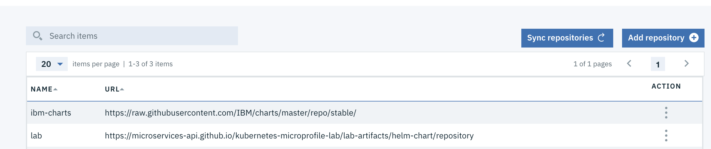

# MicroProfile Lab with IBM Cloud Private and WebSphere Liberty

This lab illustrates steps to deploy a MicroProfile application, running in a WebSphere Liberty docker container, into a Kubernetes environment, such as minikube (part 1) and IBM Cloud Private (part 2).

If you find an issue with the lab instruction you can [report it](https://github.com/microservices-api/kubernetes-microprofile-lab/issues) or better yet, [submit a PR](https://github.com/microservices-api/kubernetes-microprofile-lab/pulls).

For questions/comments about WebSphere Liberty's docker container or IBM Cloud Private please email [Arthur De Magalhaes](mailto:arthurdm@ca.ibm.com).

# Part 1: Deploying a MicroProfile application in a minikube cluster

 In this part 1 of the lab you'll build a MicroProfile application and package it inside a WebSphere Liberty docker container. You will then utilize a helm chart that deploys the Liberty container into a kubernetes cluster (minikube), with the appropriate ingress and service setup, while also deploying and configuring a Cloudant helm chart that stands up the database that holds the data for this microservice.  

 This is the simplest way for a developer to get a kubernetes cluster up and running locally in their laptop, before pushing the microservice into an enteprise grade environment such as IBM Cloud Private.

## Step 0: Before you begin

You'll need a few different artifacts to this lab.  Check if you have these installed by running:

```
git --version
mvn --version
java -version
docker --version
minikube version
helm version
```

If any of these is not installed:
* Install a [Git client](https://git-scm.com/download/mac).
* Install [Maven](https://maven.apache.org/download.cgi).
* Install a [Docker engine](https://docs.docker.com/engine/installation/).
* Install [Java 8](https://java.com/en/download/)
* Install [minikube](https://kubernetes.io/docs/tasks/tools/install-minikube/)
* Install [helm](https://docs.helm.sh/using_helm/#installing-helm)


## Step 1: Configure minikube

1. Start minikube by running `minikube start`
1. Enable ingress with the command `minikube addons enable ingress`
1. Set the Docker CLI to target the minikube Docker engine by running `eval $(minikube docker-env)`
1. Set up helm and tiller by running `helm init`
1. Wait until the following command indicates that the tiller-deploy deployment is available: `kubectl get deployment tiller-deploy --namespace kube-system`

## Step 2: Build application and container

1. Clone the project into your machine by running `git clone https://github.com/microservices-api/kubernetes-microprofile-lab.git`
1. Build the sample microservice by running `cd kubernetes-microprofile-lab/lab-artifacts` and then  `mvn clean package`
1. Build the docker image by running `docker build -t microservice-vote .`  This image is now availble in minikube's Docker registry. If you run `docker images` you will see all the images in your minikube's registry.

## Step 3: Deploy WebSphere Liberty and Cloudant helm chart

1. If using a lab machine, you may want to run the [cleanup script](#cleanup) before proceeding, to ensure you have a fresh environment.
1. Deploy the microservice with the following helm install command `helm install --name=vote helm-chart/microservice-vote`
1. You can view the status of your deployment by running `kubectl get deployments`.  You want to wait until both `microservice-vote-deployment` and `vote-ibm-cloudant-dev` deployments are available.
1. Use `kubectl get ing | awk 'FNR == 2 {print $3;}'` to determine the address of the application.  Prepend `https` and append `/openapi/ui` to that URL and open this location in a web browser to access the application. For example, `https://192.168.99.100/openapi/ui`
1. Congratulations, you have successfully deployed a [MicroProfile](http://microprofile.io/) container into a kubernetes cluster!  The deployment also included a Cloudant container that is used by our microservice, and an ingress layer to provide connectivity into the API.

## Step 4: Explore the application
The `vote` application is using various MicroProfile specifications.  The `/openapi` endpoint of the application exposes the [MicroProfile OpenAPI](http://download.eclipse.org/microprofile/microprofile-open-api-1.0.1/microprofile-openapi-spec.html) specification.  The `/openapi/ui` endpoint is a value-add from [Open Liberty](https://openliberty.io/), which WebSphere Liberty is based upon.  This UI allows developers and API consumers to invoke the API right from the browser!

1. Expand the `POST /attendee` endpoint and click the `Try it out` button.
1. Leave the `id` empty, and place your name in the `name` field.

1. Click on the `execute` button.  Scroll down and you'll see the `curl` command that was used, the `Requested URL` and then details of the response.  Copy the `id` from the `Response body`.  This entry has now been saved into the Cloudant database that our microservice is using.

*Note:*  If you find that your minikube ingress is taking too long to return the result of the invocation and you get a timeout error, you can bypass the ingress and reach the application via its NodePort layer.  To do that, simply find the NodePort port by running the command `kubectl describe service microservice-vote-service | grep NodePort | awk 'FNR == 2 {print $3;}' | awk -F '/' '{print $1;}'` and then inserting that port in your current URL using `http`, for example `http://192.168.99.100:30698/openapi/ui/`
1. Now expand the `GET /attendee/{id}`, click the `Try it out` button, and paste into the textbox the `id` you copied from the previous step.
1. Click on `execute` and inspect that the `Respond body` contains the same name that you created 2 steps ago. You successfully triggered a fetch from our WebSphere Liberty microservice into the Cloudant database.
1. Feel free to explore the other APIs and play around with the microservice!


## Step 5: Further exploration

1. If you want to update the application, you can change the source code and then run through the steps starting from `Build application and container`.  You'll notice that the OpenAPI UI will get automatically updated!
1.  After playing around with the application you can explore the helm chart to become more familiar with the way WebSphere Liberty is deployed and how it is integrated with the Cloudant subchart.
1.  You can also explore the official helm charts from IBM, available publicly at https://github.com/IBM/charts/tree/master/stable.  You will see there's an official version of the WebSphere Liberty and Open Liberty charts as well.  Try deploying these, along with other charts such as Db2.  
1. Now that you have deployed the lab in your local minikube environment, try out the IBM Cloud Private instructions from Part 2 (a take home lab) for a production-grade environment!


## Step 6: Cleanup

1. To cleanup the deployment and various related artifacts (configMaps, secrets, etc) from your minikube cluster, simply run `kubernetes-microprofile-lab/lab-artifacts/cleanup.sh`

# Part 2: Deploying a MicroProfile application in an IBM Cloud Private cluster (ICP)

This part of the lab will walk you through the deployment of our sample MicroProfile Application into an IBM Cloud Private cluster.  You'll notice that we're using the exact same artifacts (helm charts & docker containers) as the steps for minikube, which reinforces the fact that ICP is built on the open source Kubernetes framework.  

Although the exact same `helm` and `kubectl` instructions also work when targetting an ICP cluster, in this section we'll take an alternative path to the minikube instructions to showcase ICP's helm chart catalog via its user interface.

## Step 1: Install and setup IBM Cloud Private (ICP)

1. Install ICP from [here](https://www.ibm.com/support/knowledgecenter/SSBS6K_2.1.0.1/installing/installing.html).  You may choose the free Community Edition or one of the paid bundles.
1. If at any point of the lab you want to switch back into using `helm` or `kubectl`, you can simply click on the top right icon and choose `Configure client` to copy the commands necessary to configure your local CLI to target the ICP cluster:

1. Add the lab's helm repository to ICP.  On the main left-side menu, click on `Manage -> Helm Repositories`.  Click on the `Add repository` button and choose an unique name, and the following URL `https://microservices-api.github.io/kubernetes-microprofile-lab/lab-artifacts/helm-chart/repository`.



## Step 2: Deploy the fabric artifacts

1. The Microservice Builder (MSB) helm chart is part of the pre-loaded set of charts available in the Catalog, loaded from the [public repository](https://github.com/ibm/charts). So instead of performing steps 2-5 in the [helm MSB setup](https://www.ibm.com/support/knowledgecenter/SS5PWC/setup.html#running-kubernetes-in-your-development-environment) you can simply go into `Catalog -> Helm Charts` and deploy the `Microservice Builder Fabric` helm chart, by clicking on it and taking all the defaults - you just need to select a release name and the `default` namespace.

1.  You can check on the status of the fabric deployment by clicking on `Workloads -> Deployments` and then clicking on the deployment that matches the release name you chose in the previous step. Notice that ICP provides a nice helm chart management system, which allows you to `Upgrade` or `Rollback` a helm chart based on its version.

1.  Proceed with the lab once the deployment is available.


## Step 3: Build the application and docker container

1. Clone the project into your machine by running `git clone https://github.com/microservices-api/kubernetes-microprofile-lab.git`
1. Build the sample microservice by running `cd kubernetes-microprofile-lab/lab-artifacts` and then  `mvn clean package`
1. Build and tag the docker image by using `docker build` and providing a tag that matches your `<cluster_CA_domain>/<namespace>/microservice-vote`.   As an example, if your `<cluster_CA_domain>` is `mycluster.icp` and you used the `default` namespace, then your command would be `docker build -t mycluster.icp:8500/default/microservice-vote`

## Step 4: Upload the docker image to IBM Cloud Private's docker registry

We will use IBM Cloud Private's internal docker registry to host our docker image.  This allows our image to remain secured on-premises, while being available to your enterprise.  You can control which kubernetes namespace they are available under.

1. Follow the instruction on [this page](https://www.ibm.com/support/knowledgecenter/en/SSBS6K_2.1.0.1/manage_images/using_docker_cli.html) to `docker login` into the ICP docker registry.  Use the credentials you setup during installation (default is `admin/admin`).
1. Now that you're logged in the registry, you can `docker push` your tagged image (`microservice-vote`) into the ICP docker registry.  Example:  `docker push mycluster.icp:8500/default/microservice-vote`
1. Your image is now available in the ICP registry, which you can verify by going into `Catalog -> Images`.   


## Step 5: Deploy WebSphere Liberty and Cloudant helm chart

1. We are now ready to deploy the Liberty and Cloudant helm chart by using the built-in catatalog in ICP.  Simply navigate to `Catalog -> Helm Charts`, click on the `microservice-vote` chart.


1. You will notice that a `readme` page is displayed, which allows you to familiarize yourself with the helm chart before deploying.  Click on `Configure` at the bottom of the page.
1. Provide a release name (e.g. `microservice-vote`) and pick `default` as the namespace.  Change the value of `image.repository` to match the image name you uploaded earlier, for example `mycluster.icp:8500/default/microservice-vote`.  Leave the other defaults as-is.


1. Click on deploy.  A helm deployment success window pops up!
1. Let's check on our deployment.  Go into `Workloads -> Deployments` and click on the release name you picked.  Click on the `Endpoint` link, which brings up the ingress URL.   Add `/openapi/ui` to the URL to reach the OpenAPI User Interface.   For example, `https://192.168.99.100/openapi/ui`
1. Congratulations, you have successfully deployed a [MicroProfile](http://microprofile.io/) container into a kubernetes cluster!  The deployment also included a Cloudant container that is used by our microservice, and an ingress layer to provide connectivity into the API.

## Step 6: Explore the application

1. You can now explore and invoke the application the exact same way you did in the minikube environment during part 1's Step 4.

## Step 7: Stay in sync

1.  Join the ICP [technical community](https://www.ibm.com/developerworks/community/wikis/home?lang=en#!/wiki/W1559b1be149d_43b0_881e_9783f38faaff) to stay up to date with news related to IBM Cloud Private.
