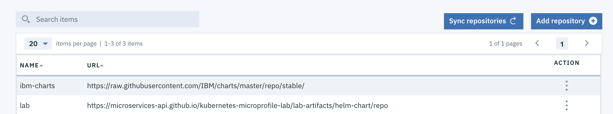

# Deploying a MicroProfile application in an IBM Cloud Private cluster (ICP)

This lab will walk you through the deployment of our sample MicroProfile Application into an IBM Cloud Private cluster.  You'll notice that we're using the exact same artifacts (helm charts & docker containers) as the instructions for minikube, which reinforces the fact that ICP is built on the open source Kubernetes framework.  

Although the exact same `helm` and `kubectl` instructions also work when targetting an ICP cluster, in this lab we'll take an alternative path to the minikube instructions to showcase ICP's helm chart catalog via its user interface.  

## Install and setup IBM Cloud Private (ICP)

1. Install ICP from [here](https://www.ibm.com/support/knowledgecenter/SSBS6K_2.1.0.1/installing/installing.html).  You may choose the free Community Edition or one of the paid bundles.  
1. Add the lab's helm repository to ICP.  On the main left-side menu, click on `Manage -> Helm Repositories`.  Click on the `Add repository` button and choose an unique name, and the following URL `https://microservices-api.github.io/kubernetes-microprofile-lab/lab-artifacts/helm-chart/repo`.

## Deploy the and fabric artifacts

1. Install minikube and the Microservice Builder fabric as described in [Running Kubernetes in your development environment](https://www.ibm.com/support/knowledgecenter/SS5PWC/setup.html#running-kubernetes-in-your-development-environment).
1. Enable ingress with the command `minikube addons enable ingress`

## Build application and container

1. Clone the project into your machine by running `git clone https://github.com/microservices-api/kubernetes-microprofile-lab.git`
1. Build the sample microservice by running `cd kubernetes-microprofile-lab/lab-artifacts` and then  `mvn clean package`
1. Set the Docker CLI to target the minikube Docker engine by running `eval $(minikube docker-env)`
1. Build the docker image by running `docker build -t microservice-vote .`

## Deploy WebSphere Liberty and Cloudant helm chart

1. Deploy the microservice with the following helm install command `helm install --name=vote helm-chart/microservice-vote`
1. You can view the status of your deployment by running `kubectl get deployments`.  You want to wait until both `microservice-vote-deployment` and `vote-ibm-cloudant-dev` deployments are available.
1. Use `kubectl get ing | awk 'FNR == 2 {print $3;}'` to determine the address of the application.  Prepend `https` and append `/openapi/ui` to that URL and open this location in a web browser to access the application. For example, `https://192.168.99.100/openapi/ui`
1. Congratulations, you have successfully deployed a [MicroProfile](http://microprofile.io/) container into a kubernetes cluster!  The deployment also included a Cloudant container that is used by our microservice, and an ingress layer to provide connectivity into the API.

## Explore the application
The `vote` application is using various MicroProfile specifications.  The `/openapi` endpoint of the application exposes the [MicroProfile OpenAPI](http://download.eclipse.org/microprofile/microprofile-open-api-1.0.1/microprofile-openapi-spec.html) specification.  The `/openapi/ui` endpoint is a value-add from [Open Liberty](https://openliberty.io/), which WebSphere Liberty is based upon.  This UI allows developers and API consumers to invoke the API right from the browser!

1. Expand the `POST /attendee` endpoint and click the `Try it out` button.
1. Leave the `id` empty, and place your name in the `name` field.

1. Click on the `execute` button.  Scroll down and you'll see the `curl` command that was used, the `Requested URL` and then details of the response.  Copy the `id` from the `Response body`.  This entry has now been saved into the Cloudant database that our microservice is using.

*Note:*  If you find that your minikube ingress is taking too long to return the result of the invocation and you get a timeout error, you can bypass the ingress and reach the application via its NodePort layer.  To do that, simply find the NodePort port by running the command `kubectl describe service microservice-vote-service | grep NodePort | awk 'FNR == 2 {print $3;}' | awk -F '/' '{print $1;}'` and then inserting that port in your current URL using `http`, for example `http://192.168.99.100:30698/openapi/ui/`
1. Now expand the `GET /attendee/{id}`, click the `Try it out` button, and paste into the textbox the `id` you copied from the previous step.
1. Click on `execute` and inspect that the `Respond body` contains the same name that you created 2 steps ago. You successfully triggered a fetch from our WebSphere Liberty microservice into the Cloudant database.
1. Feel free to explore the other APIs and play around with the microservice!
1. If you want to update the application, you can change the source code and then run through the steps starting from `Build application and container`.  You'll notice that the OpenAPI UI will get automatically updated!
