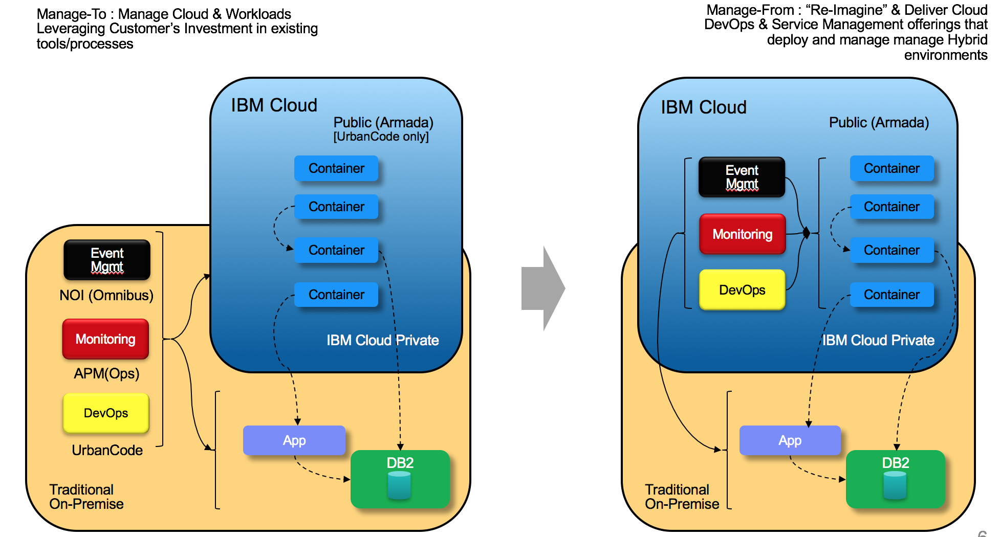
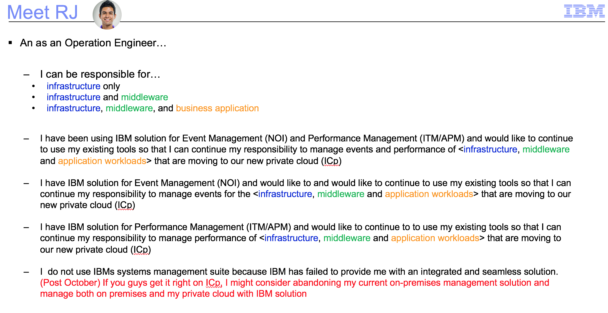

## Overview

The initial goal of ICP Event Management is to provide basic manageability though existing IBM offerings for ICp and customer workloads in the October 2017 ICp release, so that customers can start to integrate ICp into their existing processes.  In this case, Event Management integration seeks to surface ICp platform, monitoring and logging events in Netcool Operations Insights (NOI), also known as Omnibus.

The effort is part of an overall strategy to support and then integrate DevOps and Service Management with ICp, as illustrated in the following diagram.

The main persona being addressed, is outlined below

## System Context

* (a) Kubernetes events are surfaced in NOI
* (b) The Prometheus alertmanager can be configured to send events to NOI
* (c) APM and/or DevOps monitoring can send alerts as events to NOI
* (d) The logstash forwarder for ELK can be configured to also forward loge records to NOI

## Use Cases

An as an Operations Engineer, I have visibility into whether my ICp system is experiencing degradation or failures in my event console for example :

* ICp base events, e.g.:
	* Failures from Logging (ELK), Monitoring (Prometheus/heapster), Docker
	* Deployment failures, Pod failures from Kubernetes
	* Storage (GlusterFS, NFS, object storage) failures

* Basic container (stdout, stderr) messages 

* Threshold events from basic ICp monitoring
	* E.g. AlertManager events form Prometheus

* Existing Monitoring tools that are monitoring ICp/Workloads, e.g. APM, New Relic, Dynatrace, etc.

* Events and data from systems and infrastructure outside of ICp; but that ICp/ICp workloads depend on.

***Optional for October:***

* I can more effectively manage my dynamic environment by putting current resource and relationship context around otherwise isolated event and topology data via real-time topology views, searches and event correlation and enrichment.  (ICp and related topology)
* I can expedite forensics and post-mortem activities related to incidents by using historical topology and event/status views to understand my topology at a given time and to compare between two times. 
* I can execute [semi-]automated runbooks to resolve common problems in ICp

## System Flows

See System Context, above

## Customer Requirements

See "Requirements" and "Use Cases" above as a starting point.  Additional specific requirements will be added here as they are gathered.

## Reviewer Notes

Initial reviewer include (but are limited to) the following:

* Ajay Apte
* Mike Kaczmarski
* Gerd Breiter
* Robin Hernandez

## External Reviewers

## References

Issues that are being worked in the context of this Feature Spec are lined form the following epic:
